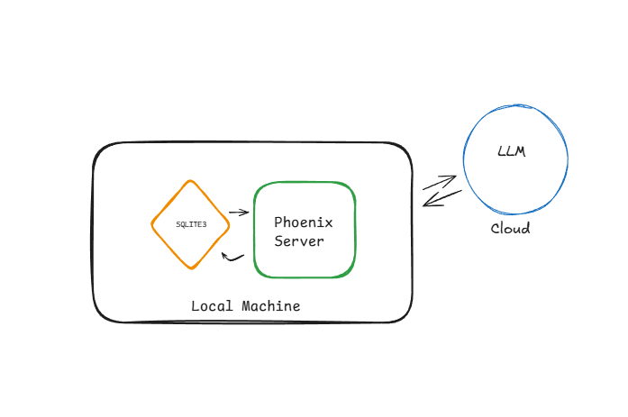
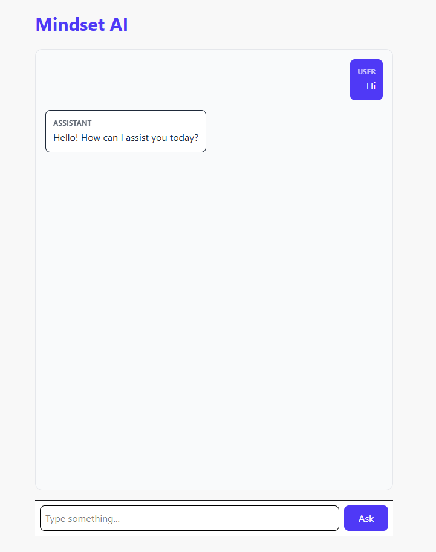

#  Mindset AI: Phase 1 - Hybrid Wrapper & Storage

##  Project Overview
Mindset AI is a full-stack chat application built with **Elixir** and **Phoenix LiveView**. Phase 1 established the **Storage Unit** and **Hybrid Wrapper**, allowing the application to persist chat history locally while communicating with external LLM services.

---

##  Technical Implementation



### **Backend & Database**
* **Engine**: Built using **Elixir 1.19.5** and **Erlang/OTP 28**.
* **Database**: Utilized **SQLite3** via **Ecto** for lightweight, local persistence.
* **Schema**: Implemented a `Message` schema in `lib/mindset/chat/message.ex` to define the data structure for `role` and `content`.
* **Migrations**: Established version-controlled database changes in `priv/repo/migrations/`.

### **Real-time UI**
* **LiveView**: Created a reactive chat interface in `MindsetWeb.ChatLive` that handles real-time updates without full-page refreshes.
* **State Management**: Optimized socket assigns to manage a growing list of messages, ensuring the UI stays in sync with the database.


##  Working Implementation
The application successfully handles real-time user input and persists conversation history.


---

##  Challenges &  Resolutions


| Incident | Root Cause | Resolution |
| :--- | :--- | :--- |
| **Path Resolution** | Relative paths in `dev.exs` were resolving inconsistently between the Terminal and the Server. | Forced absolute pathing using `Path.expand/2` in the Repo configuration. |
| **Missing Tables** | A blank migration file was executed, marking the version as "complete" without actually building the table. | Manually defined the schema in the migration and used `mix ecto.reset` to force a rebuild. |
| **Postgrex Conflicts** | A pluralization typo (`Messages` vs `Message`) caused Elixir to look for a Postgres driver instead of the local schema. | Corrected naming conventions in the `Chat` context to ensure proper Ecto Queryable implementation. |


---

## Verification & Integrity
The system was verified through rigorous testing in the **IEx (Interactive Elixir)** shell:

1.  **Integrity Check**: Confirmed table existence via `sqlite_master`.
2.  **I/O Test**: Successfully performed manual database inserts to verify persistence:
    ```elixir
    Mindset.Repo.insert!(%Mindset.Chat.Message{role: "user", content: "Test successful!"})
    ```
3.  **UI Verification**: Confirmed that `Chat.list_messages/0` correctly populates the chat window on mount.


## Development Process

I built and tested the "hidden" parts (database and logic) before building the "visible" part (the UI).

### 1. Building the Database (The Storage Unit)
Instead of making the screen first, I made sure the app could remember messages.
* **Creating the Blueprint**: I wrote the code in `lib/mindset/chat/message.ex` to tell Elixir what a "Message" looks like.
* **Fixing the Database Instructions**: I found that the migration file in `priv/repo/migrations/` was empty. I manually added the instructions to create the table so the database wouldn't be empty.
* **Manual Testing**: I used the **IEx** terminal to try saving and reading messages. This proved the database worked before I even opened a browser.


### 2. Organizing the Logic (The Context Layer)
I created a "middle-man" file at `lib/mindset/chat.ex` to handle the data.
* **Simple Functions**: I wrote functions like `list_messages` and `create_message` so the rest of the app doesn't have to deal with complicated database code.
* **Fixing Typos**: I fixed an error where the app was looking for `Messages` (plural) instead of `Message` (singular).

### 3. Building the Screen (The Web Unit)
Finally, I built the chat screen in `lib/mindset_web/live/chat_live.ex`.
* **Loading History**: When the page opens, it automatically grabs all old messages from the database using the Context.
* **Handling Chat**: When you click "Ask," the app follows these steps:
    1. Saves your message to the database.
    2. Asks the AI for a response via `Mindset.AI`.
    3. Saves the AI's response and shows it on your screen immediately.

##  Future Roadmap: Phase 2
With the Storage and UI units stable, the project is moving toward the **Native Unit**:
* **Local Intelligence**: Integrating **Nx** and **Bumblebee** to run LLMs locally.
* **Optimized Math**: Leveraging EXLA for GPU/CPU acceleration.